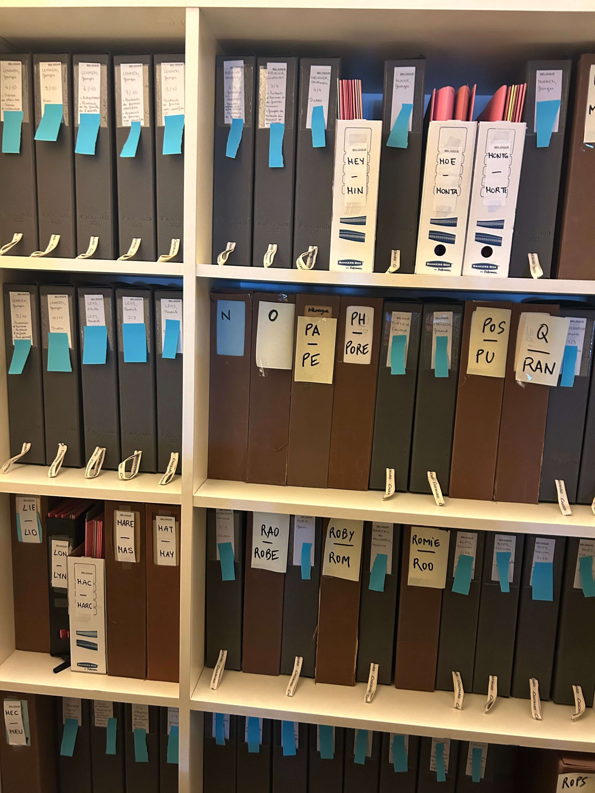
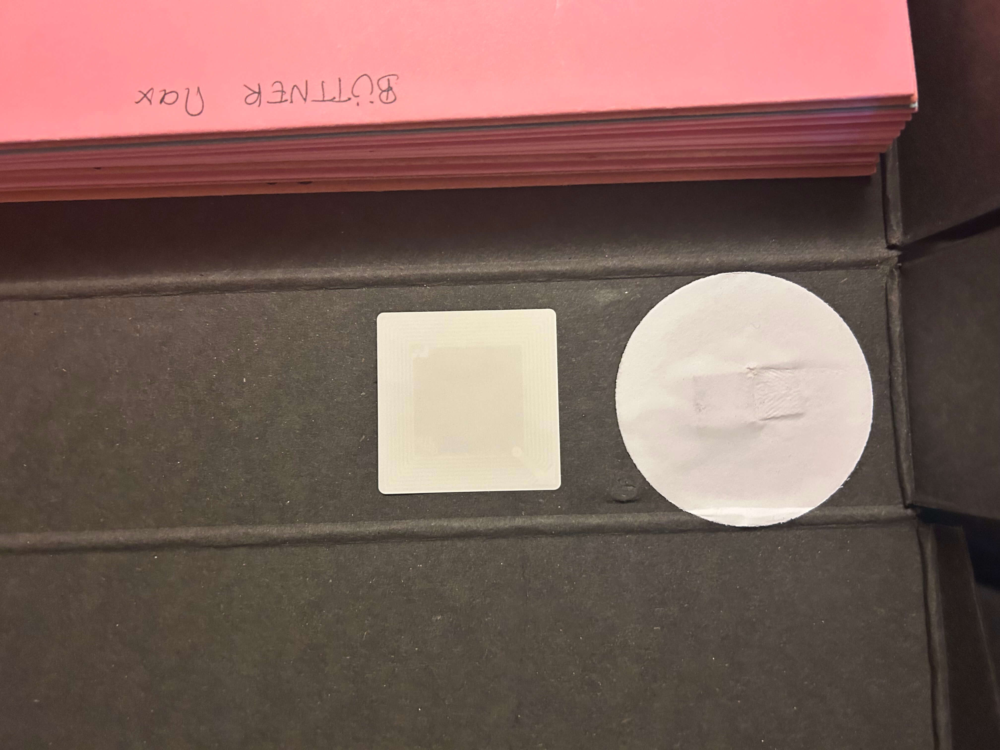

# Activités documentaires au Musée d'Orsay

*Apprentissage — Service de la documentation, Musée d'Orsay*  
*Septembre 2025 – en cours*

---

## Contexte de production

Mon alternance au sein du Service de la documentation du Musée d'Orsay (depuis septembre 2025) s'inscrit dans un moment particulier de la vie du service : la préparation du déménagement des fonds documentaires vers le futur **Centre de ressources et de recherche Daniel Marchesseau**. Dans ce contexte, j'ai choisis deux activités documentaires complémentaires qui structurent mon quotidien :

- **Le dépouillement de catalogues d'exposition et d'ouvrages**, activité intellectuelle visant à enrichir les dossiers d'œuvre du musée ;
- **Le chantier de reconditionnement et de transfert** d'une partie du fonds *Peinture étrangère* vers une réserve extérieure de la BnF.

Ces deux activités, en apparence très différentes, sont les deux faces d'un même métier : **l'une intellectuelle, l'autre matérielle**, et toutes deux indispensables à la mission de conservation et de transmission documentaire.

---
## Documents authentiques

### Chantier de reconditionnement — Fonds Peinture étrangère

*Boîtes Cochard (boîtes grises) après dédoublement des anciennes boîtes (boîtes marrons) surremplies, les post-it bleus représentent les monographies.*

*Étape du puçage RFID en vue du transfert vers la réserve BnF.*

### Dépouillement du catalogue d'accrochage architecture 2014

*[Photographies à insérer si disponibles — ou mention que le dépouillement est en cours et ne peut pas être documenté visuellement à ce jour]*

---

## Compétences mobilisées

### Savoirs

- **Connaissance des fonds documentaires patrimoniaux** d'un grand musée national
- **Cadre méthodologique du dossier d'œuvre** (constitution, structuration en pochettes thématiques : Expositions, Bibliographie, etc.)
- **Procédures de conditionnement archivistique** (typologie des boîtes Cochard, normes de conservation)
- **Identification des œuvres** par numéros d'inventaire et de dépôt
- **Logique des fonds** (fonds Levine, fonds Peinture étrangère)

### Savoir-faire

- **Dépouiller** un catalogue d'exposition et identifier les œuvres présentes dans les collections d'Orsay
- **Enrichir un dossier d'œuvre** par l'apport de références bibliographiques et d'expositions
- **Résoudre un problème de cotation** par association d'anciens numéros de dépôt avec les nouveaux numéros d'inventaire
- **Dédoubler et reconditionner** des boîtes d'archives surremplies vers un conditionnement adapté
- **Puçer en RFID** un fonds en vue d'un transfert vers une réserve extérieure
- **Travailler à plusieurs échelles** : seule, en binôme avec ma tutrice, en équipe avec les documentalistes

### Savoir-être

- **Rigueur méthodologique** dans le suivi d'un chantier de grande ampleur (100 ml de monographies)
- **Patience et constance** face à un travail répétitif mais essentiel
- **Esprit d'initiative** pour résoudre des problèmes techniques (cotation Villain)
- **Adaptabilité** entre travail intellectuel (dépouillement) et travail physique (reconditionnement)
- **Sens de la coopération** au sein d'une équipe documentaire

---

## Analyse réflexive

### Pourquoi ces documents sont significatifs

Ces deux activités sont, à mon sens, **représentatives du métier de documentaliste en milieu muséal patrimonial** : elles articulent un travail intellectuel rigoureux (recherche, identification, enrichissement de dossiers d'œuvre) avec un travail matériel concret (manipulation, conditionnement, transfert physique des fonds). Aucune des deu
