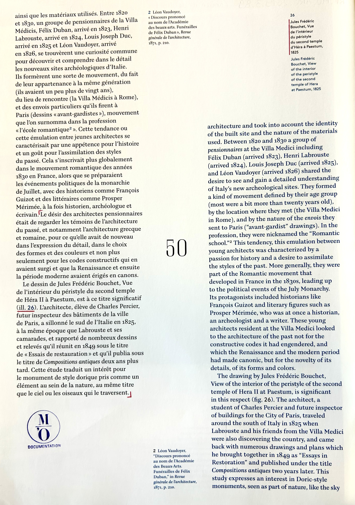

# Traitement documentaire au Musée d'Orsay

*Apprentissage — Service de la documentation, Musée d'Orsay*  
*Septembre 2025 – en cours*

---

## Contexte de production

Mon alternance au sein du Service de la documentation du Musée d'Orsay (depuis septembre 2025) s'inscrit dans un moment particulier de la vie du service : la préparation du déménagement des fonds documentaires vers le futur **Centre de ressources et de recherche Daniel Marchesseau**. Dans ce contexte, j'ai choisis deux activités documentaires complémentaires qui structurent mon quotidien :

- **Le chantier de reconditionnement et de transfert** d'une partie du fonds *Peinture étrangère* vers une réserve extérieure de la BnF ;
- **Le dépouillement de catalogues d'exposition et d'ouvrages**, activité intellectuelle visant à enrichir les dossiers d'œuvre du musée.

Ces deux activités, en apparence très différentes, sont les deux faces d'un même métier : **l'une intellectuelle, l'autre matérielle**, et toutes deux indispensables à la mission de conservation et de transmission documentaire.

---
## Documents authentiques

### Chantier de reconditionnement — Fonds Peinture étrangère

*Boîtes Cochard (boîtes grises) après dédoublement des anciennes boîtes (boîtes marrons) surremplies, les post-it bleus représentent les monographies.*

*Étape du puçage RFID en vue du transfert vers une réserve de la BnF.*

### Dépouillement du catalogue *Un Américain à Paris : dessins d'architecture de la donation Neil Levine* (accrochage architecture, 2014)

*Première étape du dépouillement (pour insertion dans un dossier d'oeuvre) : reconnaissance d'une oeuvre des collections du musée dans le catalogue ; Découpage de la page ; Annotation du numéro d'inventaire (et dans ce cas particulier annotation de l'ancien numéro de dépot) ; Création et impression d'une étiquette avec nom de l'exposition/accrochage, commissaires, lieu, date, cote du livre dans la bibliothèque du musée ; Tamponnage "M'O Documentation"*

*Deuxième étape du dépouillement : cherhcer dans le catalogue la mention de l'oeuvre et la surligner ; Mettre entre crocher la partie du texte qui apporte des informations sur l'oeuvre ; Tamponnage "M'O Documentation"*

---

## Compétences mobilisées

### Savoirs

- **Connaissance des fonds documentaires patrimoniaux** d'un grand musée national
- **Cadre méthodologique du dossier d'œuvre** (constitution, structuration en pochettes thématiques : Expositions, Bibliographie, etc.)
- **Procédures de conditionnement archivistique** (typologie des boîtes Cochard, normes de conservation)
- **Identification des œuvres** par numéros d'inventaire et de dépôt
- **Logique des fonds** (fonds Levine, fonds Peinture étrangère)

### Savoir-faire

- **Dépouiller** un catalogue d'exposition et identifier les œuvres présentes dans les collections d'Orsay
- **Enrichir un dossier d'œuvre** par l'apport de références bibliographiques et d'expositions
- **Résoudre un problème de cotation** par association d'anciens numéros de dépôt avec les nouveaux numéros d'inventaire
- **Dédoubler et reconditionner** des boîtes d'archives surremplies vers un conditionnement adapté
- **Puçer en RFID** un fonds en vue d'un transfert vers une réserve extérieure
- **Travailler à plusieurs échelles** : seule, en binôme avec ma tutrice, en équipe avec les documentalistes

### Savoir-être

- **Rigueur méthodologique** dans le suivi d'un chantier de grande ampleur (100 ml de monographies)
- **Patience et constance** face à un travail répétitif mais essentiel
- **Esprit d'initiative** pour résoudre des problèmes techniques (cotation Villain)
- **Adaptabilité** entre travail intellectuel (dépouillement) et travail physique (reconditionnement)
- **Sens de la coopération** au sein d'une équipe documentaire

---

## Analyse réflexive

### Pourquoi ces documents sont significatifs

Ces deux activités sont, à mon sens, **représentatives du métier de documentaliste en milieu muséal patrimonial** : elles articulent un travail intellectuel rigoureux (recherche, identification, enrichissement de dossiers d'œuvre) avec un travail matériel concret (manipulation, conditionnement, transfert physique des fonds). 

### Ce que les activités m'ont appris

Le **dépouillement du catalogue de l'accrochage** a été particulièrement formateur car il m'a confrontée à une difficulté concrète : ce dépouillement n'avait jamais été réaliséen raison d'incohérences entre les anciens numéros de dépôt, d'autres numéros de dépôts attribués à postérioris et les numéros d'inventaire. En reconstituant la correspondance entre ces deux systèmes de cotation pour les oeuvres de Villain (fonds Levine), j'ai compris que chaque numéros raconte une histoire sur l'oeuvre et son entrée au musée (acquisiton, dépôt, transfert), sur les personnes qui y travail dessus.

Le **chantier de reconditionnement** m'a appris à travailler à grande échelle (100 ml de monographies) et à articuler plusieurs gestes techniques : dédoubler les boîtes surremplies, transvaser dans des boîtes Cochard et pucer en RFID. J'ai mesuré combien la **conservation préventive** ne se limite pas à un savoir théorique : elle se joue dans la qualité d'un conditionnement, dans le geste précis qui prolonge la durée de vie d'un document.

### Ce qui s'est bien passé / ce que j'aurais pu faire autrement

Le travail en plusieurs configurations (seule, en binôme avec ma tutrice, en équipe) m'a permis de progresser à mon rythme tout en bénéficiant d'un accompagnement. La résolution du problème de cotation Villain a été un moment de fierté, parce qu'elle a débloqué un dépouillement en attente et mieux faire comprendre le fonds dans son intégralité.

Avec le recul, j'aurais pu **mieux documenter ma propre méthode** de mise en correspondance des numéros. C'est une démarche que j'envisage d'engager dans la suite de mon alternance.

### Mise en perspective

Ces activités s'inscrivent dans une **opération institutionnelle plus large** : la préparation du déménagement du Service de la documentation vers le CRR. C'est précisément cette opération qui constitue le **sujet de mon mémoire de M2**. Vivre ce déménagement « de l'intérieur » et le penser « de l'extérieur » dans ma recherche universitaire crée une articulation entre **terrain et réflexion**, qui nourrit ma compréhension des enjeux du métier.

---

## 🔗 Compétences associées

Voir la grille détaillée dans la section [Domaines de compétences](../../03-competences/) :
- **Traitement documentaire et archivistique** (dépouillement, gestion des dossiers d'œuvre)
- **Gestion et conservation des collections** (reconditionnement, puçage RFID, chantier de transfert)
- **Outils numériques** (résolution de problèmes de cotation, outils de traçabilité)
