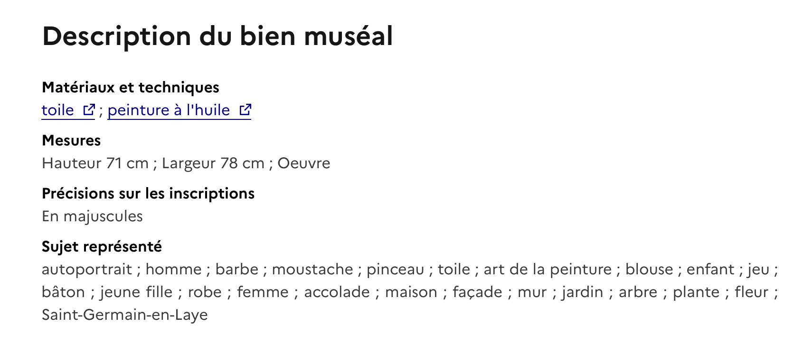
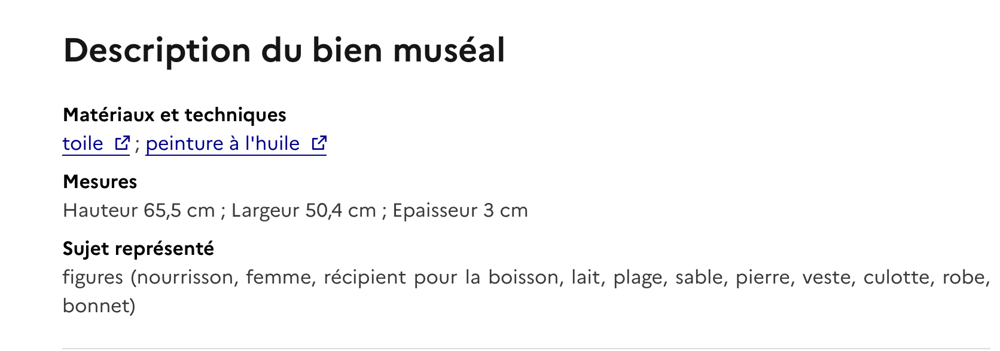
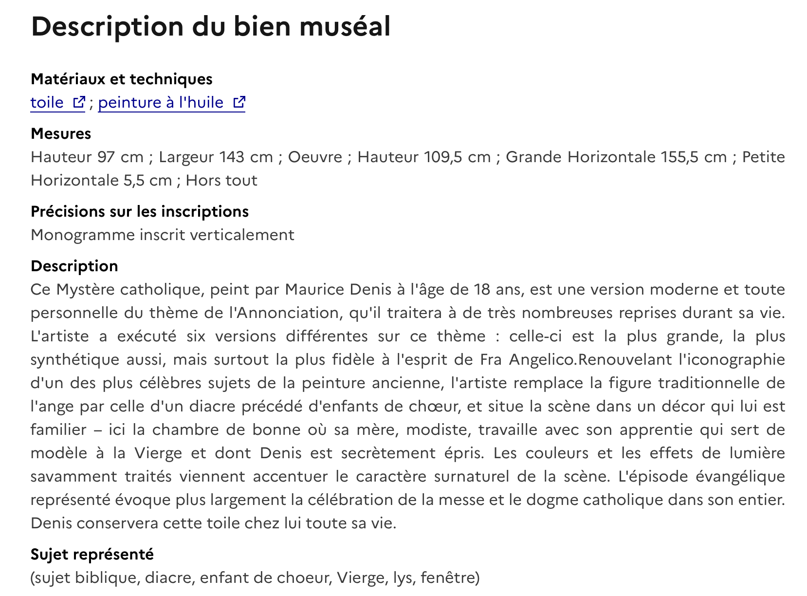

# Indexation et catalogage d'œuvres — Musée départemental Maurice Denis

*Stage documentaliste-archiviste — Musée départemental Maurice Denis, Saint-Germain-en-Laye*  
*Juin - Septembre 2025*

---

## 📌 Contexte de production

Lors de mon stage au **Musée départemental Maurice Denis** (juin-septembre 2025), j'ai contribué au catalogage et à l'indexation d'une **série d'environ 50 à 100 peintures** des collections du musée, principalement issues du fonds **Nabi**.

Ce travail s'inscrit dans la mission scientifique du service de la documentation : enrichir le **système de gestion des collections Skinsoft** en vue de l'**export vers la base nationale Joconde**, désormais intégrée à la **Plateforme Ouverte du Patrimoine (POP)** du ministère de la Culture.

J'ai bénéficié d'une **formation aux normes Joconde** dispensée par mon encadrante, qui m'a permis de comprendre l'enjeu d'une indexation rigoureuse pour la diffusion publique des collections.

---

## 📂 Documents authentiques

Les notices d'œuvres que j'ai contribué à enrichir sont aujourd'hui **publiées sur la base Joconde** et consultables librement sur le portail [pop.culture.gouv.fr](https://pop.culture.gouv.fr).

> *Exemples de notices indexées sur des oeuvres de Maurice Denis :*
>           [Notice 1 : Portrait de l'artiste au Prieuré, Maurice Denis](https://pop.culture.gouv.fr/notice/joconde/M03968020400)
>                  [Notice 2 : Le Biberon, Maurice Denis](https://pop.culture.gouv.fr/notice/joconde/M03965547013)
>            [Notice 3 : Le Mystère catholique, Maurice Denis ](https://pop.culture.gouv.fr/notice/joconde/M03966051654)
>

---

## 🛠️ Compétences mobilisées

### Savoirs

- **Normes nationales d'indexation muséale** (référentiel Joconde)
- **Vocabulaires contrôlés et thesaurus** appliqués au patrimoine muséal 
- **Chaîne de diffusion documentaire** : de Skinsoft à la base nationale ouverte (Joconde / POP)
- **Connaissance des collections nabies** et du contexte artistique de la fin du XIXᵉ siècle
- **Description matérielle et iconographique** d'une œuvre peinte

### Savoir-faire

- **Renseigner et compléter une notice** dans un SIGM (Skinsoft) selon les normes Joconde
- **Effectuer l'indexation iconographique** d'une œuvre (sujet représenté, scène, personnages, objets)
- **Décrire matériellement** une œuvre (technique, support, dimensions, marques, inscriptions)
- **Mobiliser un vocabulaire contrôlé** issu d'un thesaurus
- **Identifier les notices incomplètes** et les enrichir de manière systématique
- **Travailler à l'échelle d'un corpus** (50 à 100 œuvres) avec constance et cohérence

### Savoir-être

- **Rigueur** dans le respect des normes et la cohérence de l'indexation
- **Précision** dans la description matérielle et iconographique
- **Constance** sur un corpus important (travail de longue haleine)
- **Sens critique** face aux choix terminologiques (vocabulaire contrôlé)

---

## 🔍 Analyse réflexive

### Pourquoi ce document est significatif

Ce travail d'indexation est, dans une carrière de documentaliste muséale, **l'un des gestes les plus fondamentaux du métier**. Il traduit en données structurées et normées la matérialité d'une œuvre, pour que celle-ci soit retrouvable, comparable, étudiée par les chercheurs, et accessible au grand public.

Le fait que les notices que j'ai traitées soient **aujourd'hui publiées sur Joconde / POP** — donc consultables par toute personne — constitue une forme particulière de validation : mon travail a passé les contrôles internes du musée et participe désormais à la **diffusion publique du patrimoine national**.

### Ce que ce travail m'a appris

L'indexation iconographique m'a confrontée à un **paradoxe central de la documentation muséale** : il faut décrire une œuvre singulière (un tableau de Vuillard ne ressemble à aucun autre) avec un **vocabulaire normalisé et contrôlé** (utilisé pour tous les musées de France). Cette tension entre **singularité de l'œuvre** et **standardisation de la description** est, je l'ai compris, ce qui rend le travail à la fois exigeant et passionnant.

L'usage du **thesaurus** a été ma principale difficulté. Comment indexer une scène religieuse de Maurice Denis ? Sous quelle entrée placer une nature morte de Bonnard ? Quel terme contrôlé choisir entre plusieurs descripteurs proches ? Ces choix engagent la **trouvabilité future** de l'œuvre dans la base : un mauvais terme, et une œuvre devient invisible pour le chercheur qui la cherche.

J'ai donc dû apprendre à :
- Consulter systématiquement le thesaurus avant chaque indexation ;
- Privilégier la **précision** sur la **richesse** (un descripteur juste vaut mieux que dix imprécis) ;
- Échanger avec mon encadrante en cas de doute, pour aligner ma pratique sur avec la sienne.

### Ce qui s'est bien passé / ce que j'aurais pu faire autrement

La **formation initiale** aux normes Joconde dispensée par mon encadrante m'a donné un cadre solide pour démarrer rapidement. Le travail à l'échelle d'un **corpus de plus de 50 œuvres** m'a permis de gagner en **efficacité et en cohérence** : les premières notices étaient hésitantes, les dernières plus assurées.

Avec le recul, j'aurais pu **tenir un journal de bord** des choix terminologiques difficiles que j'ai faits, pour mieux capitaliser sur mon apprentissage et le partager. C'est une pratique réflexive que je souhaite intégrer à mes activités à venir.

### Mise en perspective

Ce travail s'inscrit dans une chaîne plus large : celle de la **mise à disposition publique du patrimoine muséal français**. Joconde, intégrée à POP, est l'un des **outils majeurs de diffusion scientifique** des collections nationales. Contribuer à cette base, même modestement, c'est participer à un **bien commun** documentaire et culturel.

Cette expérience d'indexation rejoint directement les attendus du concours de la fonction publique : maîtrise des normes, des thesaurus, des SIGM, et conscience de la chaîne de diffusion documentaire dans la fonction publique.

---

## 🔗 Compétences associées

Voir la grille détaillée dans la section [Domaines de compétences](../../03-competences/) :
- **Traitement documentaire et archivistique** (indexation, catalogage, description)
- **Outils numériques** (Skinsoft, base Joconde / POP)
- **Médiation et valorisation** (diffusion publique des collections)
